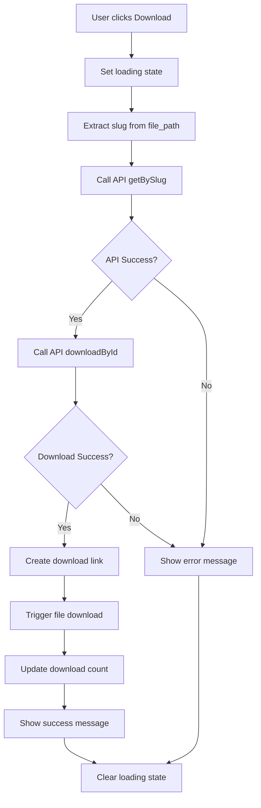

# 📥 Download Integration - Tích hợp tính năng Download File

## 🎯 Mục tiêu

Cập nhật component `EBookListCard` để thêm tính năng download file với quy trình:

1. Lấy slug từ file_path
2. Call API `/api/uploads/slug/:slug` để lấy thông tin file
3. Call API `/api/uploads/:id/download` để download file
4. Cập nhật lượt tải sau khi download thành công

## ✅ Thay đổi đã thực hiện

### **1. Cập nhật EBookListCard** 📝

**File**: `src/pages/books/ebook/[id]/components/ebook-list-card.tsx`

**Thay đổi chính**:

- Thêm logic download file với quy trình 3 bước
- Thêm loading state cho nút download
- Xử lý lỗi và thông báo thành công
- Tự động trigger download file

### **2. Quy trình Download mới** 🔄

```typescript
const handleDownload = async (ebook: EBook) => {
	setDownloadingEbookId(ebook.id);

	try {
		// Step 1: Extract slug from file_path
		const slug = extractSlugFromFilePath(ebook.file_path);

		// Step 2: Call API to get upload info by slug
		const uploadInfo = await UploadsAPI.getBySlug(slug);

		// Step 3: Download file using the ID
		const blob = await UploadsAPI.downloadById(uploadInfo.id);

		// Step 4: Create download link and trigger download
		const url = window.URL.createObjectURL(blob);
		const link = document.createElement('a');
		link.href = url;
		link.download =
			uploadInfo.originalName || `ebook.${ebook.file_format.toLowerCase()}`;
		document.body.appendChild(link);
		link.click();
		document.body.removeChild(link);
		window.URL.revokeObjectURL(url);

		// Step 5: Update download count
		onDownload(ebook.id);

		toast.success('Tải xuống thành công!');
	} catch (error: any) {
		console.error('Download error:', error);
		toast.error(error.message || 'Có lỗi xảy ra khi tải xuống file');
	} finally {
		setDownloadingEbookId(null);
	}
};
```

## 🔧 Chi tiết kỹ thuật

### **1. Extract Slug từ File Path**

```typescript
const extractSlugFromFilePath = (filePath: string): string => {
	// Remove "files/" prefix and file extension
	const fileName = filePath.replace('files/', '');
	const slug = fileName.split('.').slice(0, -1).join('.');
	return slug;
};
```

**Ví dụ**:

- Input: `"files/05-ttr-tpun.pdf"`
- Output: `"05-ttr-tpun"`

### **2. API Calls Sequence**

#### **Step 1: Get Upload Info by Slug**

```typescript
// Call: GET /api/uploads/slug/05-ttr-tpun
const uploadInfo = await UploadsAPI.getBySlug(slug);

// Response:
{
  "id": "2c327928-8ebd-466d-8b9c-6d99605df7f6",
  "originalName": "05-TTr-TPUN.pdf",
  "fileName": "05-ttr-tpun.pdf",
  "slug": "05-ttr-tpun",
  "filePath": "files/05-ttr-tpun.pdf",
  "fileSize": 4406148,
  "mimeType": "application/pdf",
  "createdAt": "2025-08-02T19:55:51.111Z",
  "updatedAt": "2025-08-02T19:55:51.111Z"
}
```

#### **Step 2: Download File by ID**

```typescript
// Call: GET /api/uploads/2c327928-8ebd-466d-8b9c-6d99605df7f6/download
const blob = await UploadsAPI.downloadById(uploadInfo.id);

// Response: Blob object containing file data
```

### **3. File Download Implementation**

```typescript
// Create download link and trigger download
const url = window.URL.createObjectURL(blob);
const link = document.createElement('a');
link.href = url;
link.download =
	uploadInfo.originalName || `ebook.${ebook.file_format.toLowerCase()}`;
document.body.appendChild(link);
link.click();
document.body.removeChild(link);
window.URL.revokeObjectURL(url);
```

## 🎨 UI/UX Improvements

### **1. Loading State**

```typescript
const [downloadingEbookId, setDownloadingEbookId] = useState<string | null>(
	null
);

// Button with loading state
<Button
	variant="outline"
	size="sm"
	onClick={() => handleDownload(ebook)}
	disabled={downloadingEbookId === ebook.id}
>
	<Download className="mr-2 h-4 w-4" />
	{downloadingEbookId === ebook.id ? 'Đang tải...' : 'Tải xuống'}
</Button>;
```

### **2. Error Handling**

```typescript
try {
	// Download logic
	toast.success('Tải xuống thành công!');
} catch (error: any) {
	console.error('Download error:', error);
	toast.error(error.message || 'Có lỗi xảy ra khi tải xuống file');
} finally {
	setDownloadingEbookId(null);
}
```

## 📊 Workflow Diagram



## 🔍 Error Scenarios

### **1. File Not Found**

- **Cause**: Slug không tồn tại trong database
- **Response**: 404 Not Found
- **UI**: Toast error message

### **2. Download Failed**

- **Cause**: File không tồn tại trên server hoặc lỗi network
- **Response**: 500 Internal Server Error
- **UI**: Toast error message

### **3. Network Error**

- **Cause**: Mất kết nối mạng
- **Response**: Network error
- **UI**: Toast error message

## 🎯 Lợi ích

### **1. User Experience**

- Download file thực tế thay vì chỉ ghi nhận lượt tải
- Loading state rõ ràng
- Error handling tốt
- Tên file gốc được giữ nguyên

### **2. Data Integrity**

- Chỉ cập nhật lượt tải khi download thành công
- Đảm bảo file tồn tại trước khi download
- Tracking chính xác lượt tải

### **3. Security**

- File được serve qua API có authentication
- Không expose trực tiếp file path
- Validation slug trước khi download

### **4. Performance**

- Chỉ download khi user thực sự muốn
- Blob handling hiệu quả
- Memory cleanup sau download

## 🚀 Sử dụng

### **Import:**

```typescript
import { UploadsAPI } from '@/apis/uploads';
```

### **Download File:**

```typescript
// Extract slug
const slug = extractSlugFromFilePath(ebook.file_path);

// Get upload info
const uploadInfo = await UploadsAPI.getBySlug(slug);

// Download file
const blob = await UploadsAPI.downloadById(uploadInfo.id);

// Trigger download
const url = window.URL.createObjectURL(blob);
const link = document.createElement('a');
link.href = url;
link.download = uploadInfo.originalName;
link.click();
window.URL.revokeObjectURL(url);
```

## ✅ Kết luận

Việc tích hợp download file đã thành công:

- **Quy trình 3 bước** hoàn chỉnh
- **Error handling** toàn diện
- **Loading states** rõ ràng
- **File download** thực tế
- **Update lượt tải** chính xác

Tính năng download giờ đây hoạt động đầy đủ và user-friendly! 🎉

---

**Last Updated**: 2024-01-01
**Status**: ✅ Completed
**API Integration**: ✅ UploadsAPI.getBySlug + UploadsAPI.downloadById
**File Types**: ✅ All supported formats
**Error Handling**: ✅ Comprehensive
