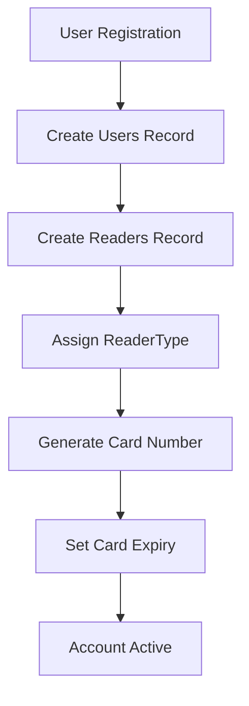
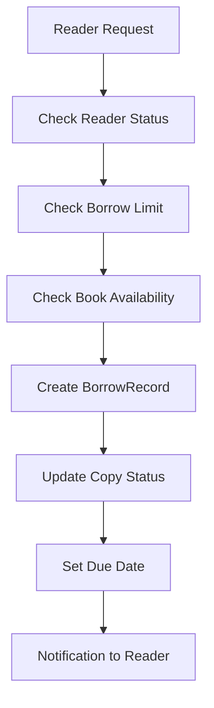
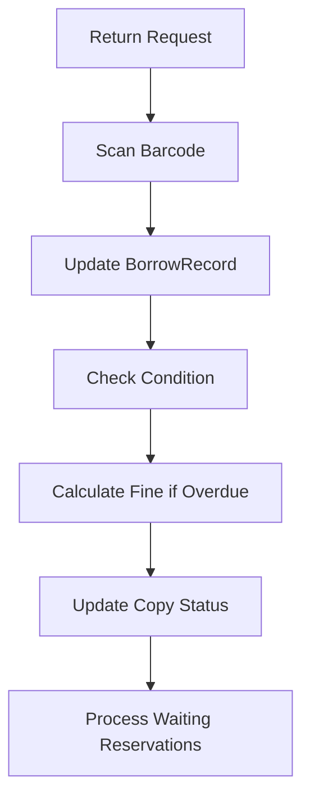
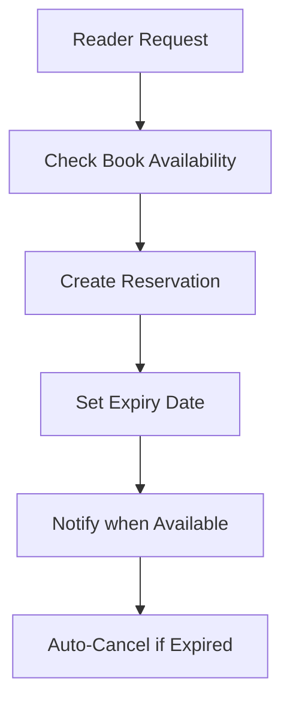

# 📚 Hệ thống Quản lý Thư viện - System Architecture

## 🎯 Tổng quan Hệ thống

Hệ thống Quản lý Thư viện là một ứng dụng web hiện đại được thiết kế để quản lý toàn bộ hoạt động của thư viện, bao gồm:

- **Quản lý người dùng**: Admin và độc giả với các quyền khác nhau
- **Quản lý sách**: Hỗ trợ cả sách vật lý và sách điện tử
- **Quản lý mượn/trả**: Quy trình mượn trả sách với tracking chi tiết
- **Hệ thống đặt trước**: Cho phép độc giả đặt trước sách
- **Quản lý phạt**: Tự động tính phạt cho sách trả muộn
- **Báo cáo và thống kê**: Theo dõi hoạt động thư viện

## 🏗️ Kiến trúc Database

### 📊 Database Schema Overview

```
🔑 Core Entities: 13 tables
👥 User Management: 3 tables (Users, ReaderTypes, Readers)
📚 Book Management: 6 tables (Books, Authors, Categories, Publishers, BookAuthors, PhysicalCopies, EBooks)
🔄 Transaction Management: 4 tables (BorrowRecords, Reservations, Renewals, Fines)
```

### 🗂️ Entity Categories

#### 1. **User Management Layer**
```sql
Users → ReaderTypes → Readers
```
- **Users**: Hệ thống authentication và authorization
- **ReaderTypes**: Phân loại độc giả (student, teacher, staff)
- **Readers**: Thông tin chi tiết độc giả

#### 2. **Content Management Layer**
```sql
Books ← BookAuthors → Authors
Books → Categories
Books → Publishers
Books → PhysicalCopies
Books → EBooks
```
- **Books**: Thông tin sách cơ bản
- **Authors**: Quản lý tác giả
- **BookAuthors: Quản lý tác giá và sách
- **Categories**: Phân loại sách
- **Publishers**: Nhà xuất bản
- **PhysicalCopies**: Bản sao vật lý
- **EBooks**: Sách điện tử

#### 3. **Transaction Management Layer**
```sql
BorrowRecords → Renewals
BorrowRecords → Fines
Reservations
```
- **BorrowRecords**: Lịch sử mượn sách
- **Reservations**: Đặt trước sách
- **Renewals**: Gia hạn sách
- **Fines**: Quản lý phạt

## 📋 Chi tiết Entities

### 👥 User Management

#### **Users Table**
```typescript
interface User {
  id: uuid;
  username: string;          // Unique username
  password: string;          // Hashed password
  email: string;             // Email address
  role: 'admin' | 'reader';  // User role
  account_status: 'active' | 'suspended' | 'banned';
  created_at: datetime;
  last_login: datetime;
}
```

#### **ReaderTypes Table**
```typescript
interface ReaderType {
  id: uuid;
  type_name: 'student' | 'teacher' | 'staff';
  max_borrow_limit: number;      // Số sách tối đa được mượn
  borrow_duration_days: number;  // Thời gian mượn (ngày)
}
```

#### **Readers Table**
```typescript
interface Reader {
  id: uuid;
  user_id: uuid;                 // Link to Users
  reader_type_id: uuid;          // Link to ReaderTypes
  full_name: string;
  dob: date;
  gender: 'male' | 'female' | 'other';
  address: string;
  phone: string;
  card_number: string;           // Unique card number
  card_issue_date: date;
  card_expiry_date: date;
  is_active: boolean;
}
```

### 📚 Book Management

#### **Books Table**
```typescript
interface Book {
  id: uuid;
  title: string;
  isbn: string;                  // Unique ISBN
  publish_year: number;
  edition: string;
  description: string;
  cover_image: string;
  language: string;
  page_count: number;
  book_type: 'physical' | 'ebook';
  physical_type: 'library_use' | 'borrowable';  // Chỉ cho sách vật lý
  publisher_id: uuid;
  category_id: uuid;
}
```

#### **Authors Table**
```typescript
interface Author {
  id: uuid;
  author_name: string;
  bio: string;
  nationality: string;
}
```

#### **BookAuthors Table**
```typescript
interface BookAuthor {
  id: uuid;                     // ID duy nhất của bản ghi
  book_id: uuid;                // Liên kết đến sách
  author_id: uuid;              // Liên kết đến tác giả
}
```

- **Mô tả**: Bảng này lưu trữ mối quan hệ giữa sách và tác giả, cho phép một sách có nhiều tác giả và một tác giả có thể viết nhiều sách.
- **Khóa ngoại**:
  - `book_id`: Liên kết đến bảng `Books`.
  - `author_id`: Liên kết đến bảng `Authors`.
- **Quy tắc**: Mỗi bản ghi trong bảng này đại diện cho một mối quan hệ giữa một sách và một tác giả.


#### **Categories Table**
```typescript
interface Category {
  id: uuid;
  category_name: string;
  description: string;
}
```

#### **Publishers Table**
```typescript
interface Publisher {
  id: uuid;
  publisher_name: string;
  address: string;
  phone: string;
  email: string;
}
```

#### **PhysicalCopies Table**
```typescript
interface PhysicalCopy {
  id: uuid;
  book_id: uuid;
  barcode: string;               // Unique barcode
  status: 'available' | 'borrowed' | 'reserved' | 'damaged' | 'lost' | 'maintenance';
  current_condition: 'new' | 'good' | 'worn' | 'damaged';
  condition_details: string;
  purchase_date: date;
  purchase_price: decimal;
  location: string;              // Vị trí trong thư viện
  notes: string;
  last_checkup_date: date;
  is_archived: boolean;
}
```

#### **EBooks Table**
```typescript
interface EBook {
  id: uuid;
  book_id: uuid;
  file_path: string;
  file_size: number;
  file_format: string;
  download_count: number;
}
```

### 🔄 Transaction Management

#### **BorrowRecords Table**
```typescript
interface BorrowRecord {
  id: uuid;
  reader_id: uuid;
  copy_id: uuid;                 // Physical copy ID
  borrow_date: datetime;
  due_date: datetime;
  return_date: datetime;
  status: 'borrowed' | 'returned' | 'overdue' | 'renewed';
  librarian_id: uuid;            // Who processed the transaction
}
```

#### **Reservations Table**
```typescript
interface Reservation {
  id: uuid;
  reader_id: uuid;
  book_id: uuid;
  reservation_date: datetime;
  expiry_date: datetime;
  status: 'pending' | 'fulfilled' | 'cancelled' | 'expired';
}
```

#### **Renewals Table**
```typescript
interface Renewal {
  id: uuid;
  borrow_id: uuid;
  renewal_date: datetime;
  new_due_date: datetime;
  librarian_id: uuid;
}
```

#### **Fines Table**
```typescript
interface Fine {
  id: uuid;
  borrow_id: uuid;
  fine_amount: decimal;
  fine_date: datetime;
  reason: string;
  status: 'unpaid' | 'paid';
  payment_date: datetime;
}
```

## 🔗 Relationships & Constraints

### **Primary Relationships**
1. **Users → Readers**: One-to-One relationship
2. **ReaderTypes → Readers**: One-to-Many relationship
3. **Books → PhysicalCopies**: One-to-Many relationship
4. **Books → EBooks**: One-to-Many relationship
5. **Books ↔ Authors**: Many-to-Many (via BookAuthors)
6. **Readers → BorrowRecords**: One-to-Many relationship
7. **PhysicalCopies → BorrowRecords**: One-to-Many relationship
8. **BorrowRecords → Renewals**: One-to-Many relationship
9. **BorrowRecords → Fines**: One-to-Many relationship

### **Key Constraints**
- **UUID Primary Keys**: Tất cả tables sử dụng UUID
- **Unique Constraints**: username, email, card_number, barcode, isbn
- **Enum Constraints**: role, account_status, book_type, status fields
- **Foreign Key Constraints**: Đảm bảo referential integrity
- **Indexes**: Optimize queries cho borrow_status, due_date

## 🚀 Business Logic & Rules

### **Reader Management Rules**
1. **Reader Types có giới hạn mượn khác nhau**:
   - Student: Thường 3-5 cuốn
   - Teacher: 10-15 cuốn
   - Staff: 5-10 cuốn

2. **Card Management**:
   - Mỗi reader có card_number unique
   - Card có expiry_date
   - Chỉ active readers mới được mượn

### **Book Management Rules**
1. **Book Types**:
   - `physical`: Sách vật lý
   - `ebook`: Sách điện tử

2. **Physical Types**:
   - `library_use`: Chỉ đọc tại thư viện
   - `borrowable`: Có thể mượn về

3. **Copy Status Management**:
   - `available` → `borrowed` → `available`
   - `reserved` → `borrowed`
   - `damaged`/`lost`/`maintenance` → không available

### **Borrowing Rules**
1. **Borrow Limits**: Dựa trên ReaderType
2. **Due Date**: Tự động tính theo borrow_duration_days
3. **Overdue Detection**: Status tự động chuyển thành 'overdue'
4. **Renewal Rules**: Có thể gia hạn nếu không có reservation

### **Fine Calculation**
1. **Overdue Fines**: Tự động tính theo số ngày trễ
2. **Damage Fines**: Manual entry bởi librarian
3. **Lost Book Fines**: Theo giá trị sách

## 📊 System Workflows

### **1. User Registration & Authentication**


### **2. Book Borrowing Process**


### **3. Book Return Process**


### **4. Reservation System**


## 🔍 Key Features & Capabilities

### **1. Advanced Search & Discovery**
- Full-text search qua title, author, ISBN
- Filter theo category, publisher, language
- Advanced search với multiple criteria
- Recommendation system

### **2. Inventory Management**
- Real-time tracking của copy status
- Automatic availability updates
- Condition monitoring
- Purchase tracking

### **3. Reader Management**
- Flexible reader types với different privileges
- Card management system
- Activity tracking
- Fine management

### **4. Analytics & Reporting**
- Popular books tracking
- Reader activity reports
- Overdue book reports
- Fine collection reports
- Inventory utilization

### **5. Digital Library Support**
- EBook management
- File format support
- Download tracking
- Digital rights management

## 🛡️ Security & Data Protection

### **Data Security**
- Password hashing
- UUID-based IDs (không sequential)
- Role-based access control
- Session management

### **Privacy Protection**
- Reader data encryption
- Audit trails
- Data retention policies
- GDPR compliance ready

## 🚀 Performance Optimization

### **Database Indexes**
```sql
-- Critical indexes for performance
CREATE INDEX borrow_status_index ON BorrowRecords(reader_id, status);
CREATE INDEX due_date_index ON BorrowRecords(due_date);
CREATE INDEX book_type_index ON Books(book_type, physical_type);
```

### **Query Optimization**
- Pagination cho large datasets
- Efficient joins với proper indexing
- Caching cho frequently accessed data
- Database connection pooling

## 📈 Scalability Considerations

### **Horizontal Scaling**
- Read replicas cho reporting
- Sharding strategies cho large datasets
- CDN cho book covers và ebook files

### **Vertical Scaling**
- Memory optimization
- CPU optimization cho search queries
- Storage optimization cho file management

## 🔧 Integration Points

### **External Systems**
- **Email Service**: Notifications và reminders
- **SMS Service**: Overdue notifications
- **Payment Gateway**: Fine payments
- **Barcode Scanner**: Physical copy management
- **Digital Library APIs**: EBook integration

### **API Endpoints**
- RESTful API cho all operations
- GraphQL support cho complex queries
- WebSocket cho real-time notifications
- Webhook support cho integrations

## 📝 Future Enhancements

### **Phase 1 - Core Features**
- ✅ Basic CRUD operations
- ✅ Authentication & Authorization
- ✅ Borrowing & Return system
- ✅ Fine management

### **Phase 2 - Advanced Features**
- 📋 Mobile app support
- 📋 Advanced analytics
- 📋 Integration với external systems
- 📋 AI-powered recommendations

### **Phase 3 - Enterprise Features**
- 📋 Multi-library support
- 📋 Advanced reporting
- 📋 Workflow automation
- 📋 Enterprise integrations

---

## 📞 Technical Support

**Database Schema Version**: 1.0
**Last Updated**: 2024-01-01
**Schema Complexity**: 13 tables, 20+ relationships
**Estimated Records**:
- Books: 10,000+
- Readers: 5,000+
- Transactions: 50,000+/year

**Performance Targets**:
- Search Response: < 200ms
- Borrow Transaction: < 500ms
- Report Generation: < 2s
- Concurrent Users: 100+
