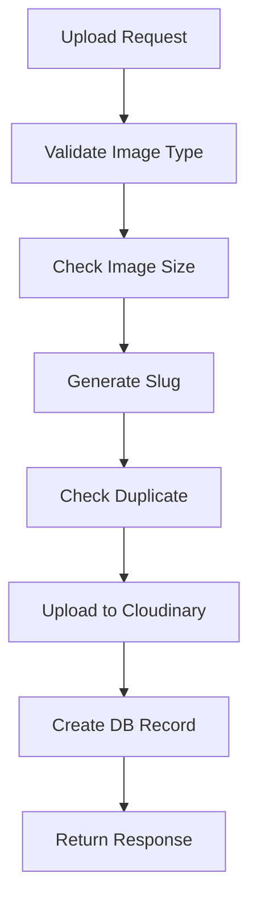

# 🖼️ Module Images - Quản lý Upload Image lên Cloudinary

## 🎯 Tổng quan

Module Images được thiết kế để quản lý việc upload và lưu trữ image lên Cloudinary trong hệ thống thư viện. Module này hỗ trợ:

- ✅ **Upload image lên Cloudinary** với validation nghiêm ngặt
- ✅ **Tự động tạo slug** từ tên image gốc
- ✅ **Image optimization** tự động với Cloudinary
- ✅ **Database tracking** với đầy đủ metadata
- ✅ **Image transformation** với Cloudinary URL
- ✅ **Swagger documentation** tiếng Việt

## 🏗️ Kiến trúc Module

### 📊 Database Schema

```sql
CREATE TABLE images (
  id UUID PRIMARY KEY DEFAULT gen_random_uuid(),
  original_name VARCHAR(255) NOT NULL,
  file_name VARCHAR(300) UNIQUE NOT NULL,
  slug VARCHAR(300) UNIQUE NOT NULL,
  cloudinary_url VARCHAR(500) NOT NULL,
  cloudinary_public_id VARCHAR(300) NOT NULL,
  file_size BIGINT NOT NULL,
  mime_type VARCHAR(100) NOT NULL,
  width INTEGER,
  height INTEGER,
  format VARCHAR(10) NOT NULL,
  created_at TIMESTAMP DEFAULT CURRENT_TIMESTAMP,
  updated_at TIMESTAMP DEFAULT CURRENT_TIMESTAMP
);
```

### 🗂️ Cấu trúc Entity

```typescript
interface Image {
  id: string; // UUID primary key
  originalName: string; // Tên gốc image (ví dụ: "hình ảnh mẫu.jpg")
  fileName: string; // Tên image đã đổi (ví dụ: "hinh-anh-mau.jpg")
  slug: string; // Slug từ tên image (ví dụ: "hinh-anh-mau")
  cloudinaryUrl: string; // URL của image trên Cloudinary
  cloudinaryPublicId: string; // Public ID của image trên Cloudinary
  fileSize: number; // Kích thước image (bytes)
  mimeType: string; // MIME type (image/jpeg, image/png, etc.)
  width?: number; // Chiều rộng image (pixels)
  height?: number; // Chiều cao image (pixels)
  format: string; // Format của image (jpg, png, etc.)
  createdAt: Date; // Ngày tạo
  updatedAt: Date; // Ngày cập nhật
}
```

## 🚀 API Endpoints

### 1. **Upload Image lên Cloudinary**

```http
POST /images/upload
Content-Type: multipart/form-data
```

**Request Body:**

```form-data
file: [Image file] (JPEG, PNG, GIF, WebP - max 10MB)
```

**Response (201):**

```json
{
  "id": "550e8400-e29b-41d4-a716-446655440000",
  "originalName": "hình ảnh mẫu.jpg",
  "fileName": "hinh-anh-mau.jpg",
  "slug": "hinh-anh-mau",
  "cloudinaryUrl": "https://res.cloudinary.com/dcwdrvxdg/image/upload/v1234567890/quan-ly-thu-vien-cua-duong/hinh-anh-mau.jpg",
  "cloudinaryPublicId": "quan-ly-thu-vien-cua-duong/hinh-anh-mau",
  "fileSize": 1048576,
  "mimeType": "image/jpeg",
  "width": 1920,
  "height": 1080,
  "format": "jpg",
  "createdAt": "2024-01-01T00:00:00.000Z",
  "updatedAt": "2024-01-01T00:00:00.000Z"
}
```

### 2. **Lấy danh sách Images**

```http
GET /images
```

**Response (200):**

```json
[
  {
    "id": "550e8400-e29b-41d4-a716-446655440000",
    "originalName": "hình ảnh mẫu.jpg",
    "fileName": "hinh-anh-mau.jpg",
    "slug": "hinh-anh-mau",
    "cloudinaryUrl": "https://res.cloudinary.com/dcwdrvxdg/image/upload/v1234567890/quan-ly-thu-vien-cua-duong/hinh-anh-mau.jpg",
    "cloudinaryPublicId": "quan-ly-thu-vien-cua-duong/hinh-anh-mau",
    "fileSize": 1048576,
    "mimeType": "image/jpeg",
    "width": 1920,
    "height": 1080,
    "format": "jpg",
    "createdAt": "2024-01-01T00:00:00.000Z",
    "updatedAt": "2024-01-01T00:00:00.000Z"
  }
]
```

### 3. **Lấy thông tin Image theo ID**

```http
GET /images/:id
```

**Response (200):**

```json
{
  "id": "550e8400-e29b-41d4-a716-446655440000",
  "originalName": "hình ảnh mẫu.jpg",
  "fileName": "hinh-anh-mau.jpg",
  "slug": "hinh-anh-mau",
  "cloudinaryUrl": "https://res.cloudinary.com/dcwdrvxdg/image/upload/v1234567890/quan-ly-thu-vien-cua-duong/hinh-anh-mau.jpg",
  "cloudinaryPublicId": "quan-ly-thu-vien-cua-duong/hinh-anh-mau",
  "fileSize": 1048576,
  "mimeType": "image/jpeg",
  "width": 1920,
  "height": 1080,
  "format": "jpg",
  "createdAt": "2024-01-01T00:00:00.000Z",
  "updatedAt": "2024-01-01T00:00:00.000Z"
}
```

### 4. **Lấy thông tin Image theo Slug**

```http
GET /images/slug/:slug
```

**Response (200):**

```json
{
  "id": "550e8400-e29b-41d4-a716-446655440000",
  "originalName": "hình ảnh mẫu.jpg",
  "fileName": "hinh-anh-mau.jpg",
  "slug": "hinh-anh-mau",
  "cloudinaryUrl": "https://res.cloudinary.com/dcwdrvxdg/image/upload/v1234567890/quan-ly-thu-vien-cua-duong/hinh-anh-mau.jpg",
  "cloudinaryPublicId": "quan-ly-thu-vien-cua-duong/hinh-anh-mau",
  "fileSize": 1048576,
  "mimeType": "image/jpeg",
  "width": 1920,
  "height": 1080,
  "format": "jpg",
  "createdAt": "2024-01-01T00:00:00.000Z",
  "updatedAt": "2024-01-01T00:00:00.000Z"
}
```

### 5. **Lấy URL của Image theo ID**

```http
GET /images/:id/url
```

**Response (200):**

```json
{
  "url": "https://res.cloudinary.com/dcwdrvxdg/image/upload/v1234567890/quan-ly-thu-vien-cua-duong/hinh-anh-mau.jpg",
  "publicId": "quan-ly-thu-vien-cua-duong/hinh-anh-mau"
}
```

### 6. **Lấy URL của Image theo Slug**

```http
GET /images/slug/:slug/url
```

**Response (200):**

```json
{
  "url": "https://res.cloudinary.com/dcwdrvxdg/image/upload/v1234567890/quan-ly-thu-vien-cua-duong/hinh-anh-mau.jpg",
  "publicId": "quan-ly-thu-vien-cua-duong/hinh-anh-mau"
}
```

### 7. **Lấy URL Image với Transformation theo ID**

```http
GET /images/:id/transform
```

**Response (200):**

```json
{
  "url": "https://res.cloudinary.com/dcwdrvxdg/image/upload/w_300,h_300,c_fill,q_auto/v1234567890/quan-ly-thu-vien-cua-duong/hinh-anh-mau.jpg"
}
```

### 8. **Lấy URL Image với Transformation theo Slug**

```http
GET /images/slug/:slug/transform
```

**Response (200):**

```json
{
  "url": "https://res.cloudinary.com/dcwdrvxdg/image/upload/w_300,h_300,c_fill,q_auto/v1234567890/quan-ly-thu-vien-cua-duong/hinh-anh-mau.jpg"
}
```

### 9. **Cập nhật thông tin Image**

```http
PATCH /images/:id
Content-Type: application/json
```

**Request Body:**

```json
{
  "imageName": "hình ảnh mới"
}
```

### 10. **Xóa Image**

```http
DELETE /images/:id
```

**Response (204):** No Content

## 🛡️ Validation & Security

### **Image Validation**

- ✅ **MIME Type**: Chỉ cho phép `image/jpeg`, `image/jpg`, `image/png`, `image/gif`, `image/webp`
- ✅ **File Size**: Tối đa 10MB (10 _ 1024 _ 1024 bytes)
- ✅ **Image Name**: Không được trống, tối đa 255 ký tự
- ✅ **Duplicate Check**: Kiểm tra image trùng lặp

### **Slug Generation**

```typescript
// Ví dụ slug generation
"hình ảnh mẫu" → "hinh-anh-mau"
"Hình ảnh thư viện 2024" → "hinh-anh-thu-vien-2024"
"Library-Image-V1.2" → "library-image-v1-2"
```

### **Cloudinary Configuration**

- ☁️ **Cloud Name**: `dcwdrvxdg`
- 📁 **Folder**: `quan-ly-thu-vien-cua-duong`
- 🔧 **Auto Optimization**: Chất lượng tự động, format tối ưu
- 🎨 **Transformations**: Resize, crop, quality optimization

## 🔧 Business Logic

### **Upload Process**



### **Cloudinary Integration**

```typescript
// 1. Cấu hình Cloudinary
cloudinary.config({
  cloud_name: 'dcwdrvxdg',
  api_key: '859132164662631',
  api_secret: 'qLvh4PvwxLUfLUAMkZCbCgamU4Q',
});

// 2. Upload với optimization
const uploadResult = await cloudinary.uploader.upload(file, {
  folder: 'quan-ly-thu-vien-cua-duong',
  public_id: imageSlug,
  transformation: [{ quality: 'auto:good' }, { fetch_format: 'auto' }],
});

// 3. Lưu metadata
const image = {
  cloudinaryUrl: uploadResult.secure_url,
  cloudinaryPublicId: uploadResult.public_id,
  width: uploadResult.width,
  height: uploadResult.height,
  format: uploadResult.format,
};
```

## 📁 Cấu trúc Files

```
project-root/
├── src/images/
│   ├── dto/
│   │   ├── create-image.dto.ts      # DTO cho upload
│   │   └── update-image.dto.ts      # DTO cho update
│   ├── entities/
│   │   └── image.entity.ts          # Entity Image
│   ├── images.controller.ts         # REST endpoints
│   ├── images.service.ts            # Business logic + Cloudinary
│   ├── images.module.ts             # Module definition
│   └── README.md                    # Documentation này
│
├── .env                             # Cloudinary config
└── ...
```

## 🧪 Testing

### **Test Upload với cURL**

```bash
# Upload image
curl -X POST "http://localhost:8002/images/upload" \
  -H "Content-Type: multipart/form-data" \
  -F "file=@sample.jpg"
```

### **Test URL với cURL**

```bash
# Lấy URL image
curl "http://localhost:8002/images/slug/hinh-anh-mau/url"

# Lấy URL với transformation
curl "http://localhost:8002/images/slug/hinh-anh-mau/transform"
```

### **Test với Swagger UI**

1. Truy cập: `http://localhost:8002/api`
2. Tìm section "Images - Quản lý Upload Image lên Cloudinary"
3. Test các endpoint trực tiếp

## ⚠️ Error Handling

### **Common Errors**

#### **400 Bad Request**

```json
{
  "statusCode": 400,
  "message": "Chỉ cho phép upload file image (JPEG, PNG, GIF, WebP)"
}
```

```json
{
  "statusCode": 400,
  "message": "Image không được quá 10MB"
}
```

```json
{
  "statusCode": 400,
  "message": "Image với tên này đã tồn tại"
}
```

```json
{
  "statusCode": 400,
  "message": "Lỗi khi upload lên Cloudinary: Invalid API key"
}
```

#### **404 Not Found**

```json
{
  "statusCode": 404,
  "message": "Không tìm thấy image với ID {id}"
}
```

## 🔄 Integration với Books

Module Images có thể được tích hợp với module Books để:

1. **Upload Book Cover**: Upload ảnh bìa sách
2. **Image Management**: Quản lý ảnh sách
3. **Cover Display**: Hiển thị ảnh bìa với transformation

### **Ví dụ Integration**

```typescript
// Trong Books service
async createBook(createBookDto: CreateBookDto, coverImage: Express.Multer.File) {
  // Upload cover image
  const image = await this.imagesService.uploadImage(coverImage);

  // Tạo Book record với cover image
  const book = this.bookRepository.create({
    ...createBookDto,
    coverImageUrl: image.cloudinaryUrl,
    coverImageId: image.id
  });

  return await this.bookRepository.save(book);
}
```

## 📈 Performance Considerations

### **Cloudinary Benefits**

- ✅ **CDN**: Global content delivery network
- ✅ **Auto Optimization**: Tự động tối ưu chất lượng và kích thước
- ✅ **Transformations**: Real-time image transformations
- ✅ **Format Optimization**: Tự động chọn format tốt nhất (WebP, AVIF)

### **Database Optimization**

```sql
-- Indexes cho performance
CREATE INDEX images_slug_idx ON images(slug);
CREATE INDEX images_created_at_idx ON images(created_at);
CREATE INDEX images_file_name_idx ON images(file_name);
CREATE INDEX images_cloudinary_public_id_idx ON images(cloudinary_public_id);
```

## 🚀 Future Enhancements

### **Phase 1 - Core Features**

- ✅ Image upload với Cloudinary
- ✅ Slug generation
- ✅ Database tracking
- ✅ URL management

### **Phase 2 - Advanced Features**

- 📋 **Multiple Formats**: Tự động tạo nhiều format (WebP, AVIF)
- 📋 **Responsive Images**: Tự động tạo images cho mobile/desktop
- 📋 **Image Cropping**: Smart cropping với AI
- 📋 **Bulk Upload**: Upload nhiều images cùng lúc

### **Phase 3 - Enterprise Features**

- 📋 **Image Analytics**: Theo dõi lượt xem, download
- 📋 **Access Control**: Phân quyền truy cập images
- 📋 **Watermarking**: Tự động thêm watermark
- 📋 **Image Search**: Tìm kiếm images bằng AI

## 📞 Technical Support

**Module Version**: 1.0
**Last Updated**: 2024-01-01
**Dependencies**:

- `cloudinary`
- `@nestjs/platform-express`
- `multer`
- `slug`
- `typeorm`

**Cloudinary Configuration**:

- **Cloud Name**: `dcwdrvxdg`
- **API Key**: `859132164662631`
- **Folder**: `quan-ly-thu-vien-cua-duong`

**Performance Targets**:

- Upload Response: < 3s (cho image 10MB)
- URL Generation: < 100ms
- Transformation Response: < 200ms
- Concurrent Uploads: 5+

---

## 📝 Changelog

- `2024-01-01`: Khởi tạo module Images với Cloudinary integration
- `2024-01-01`: Thêm slug generation và image validation
- `2024-01-01`: Hoàn thiện Swagger documentation
- `Các cập nhật tiếp theo sẽ được ghi chú tại đây...`
