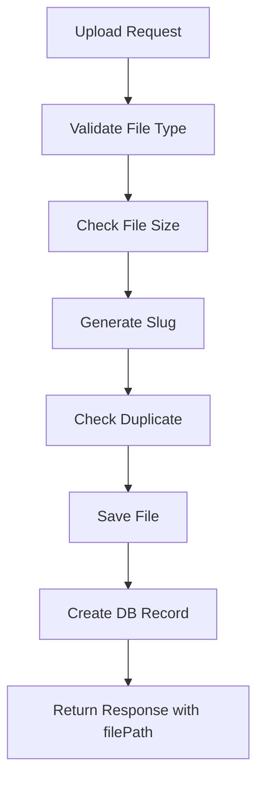
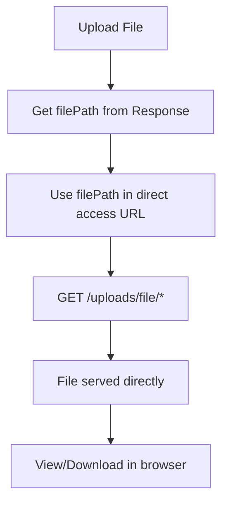

# 📁 Module Uploads - Quản lý Upload File PDF

## 🎯 Tổng quan

Module Uploads được thiết kế để quản lý việc upload và lưu trữ file PDF trong hệ thống thư viện. Module này hỗ trợ:

- ✅ **Upload file PDF** với validation nghiêm ngặt
- ✅ **Tự động tạo slug** từ tên file gốc
- ✅ **Lưu trữ có tổ chức** trong thư mục `files/`
- ✅ **Database tracking** với đầy đủ metadata
- ✅ **Download file** theo ID hoặc slug
- ✅ **Swagger documentation** tiếng Việt

## 🏗️ Kiến trúc Module

### 📊 Database Schema

```sql
CREATE TABLE uploads (
  id UUID PRIMARY KEY DEFAULT gen_random_uuid(),
  original_name VARCHAR(255) NOT NULL,
  file_name VARCHAR(300) UNIQUE NOT NULL,
  slug VARCHAR(300) UNIQUE NOT NULL,
  file_path VARCHAR(500) NOT NULL,
  file_size BIGINT NOT NULL,
  mime_type VARCHAR(100) NOT NULL,
  created_at TIMESTAMP DEFAULT CURRENT_TIMESTAMP,
  updated_at TIMESTAMP DEFAULT CURRENT_TIMESTAMP
);
```

### 🗂️ Cấu trúc Entity

```typescript
interface Upload {
	id: string; // UUID primary key
	originalName: string; // Tên gốc file (ví dụ: "tài liệu mẫu.pdf")
	fileName: string; // Tên file đã đổi (ví dụ: "tai-lieu-mau.pdf")
	slug: string; // Slug từ tên file (ví dụ: "tai-lieu-mau")
	filePath: string; // Đường dẫn file (ví dụ: "files/tai-lieu-mau.pdf")
	fileSize: number; // Kích thước file (bytes)
	mimeType: string; // MIME type (application/pdf)
	createdAt: Date; // Ngày tạo
	updatedAt: Date; // Ngày cập nhật
}
```

## 🚀 API Endpoints

### 1. **Upload File PDF**

```http
POST /uploads/upload
Content-Type: multipart/form-data
```

**Request Body:**

```form-data
file: [PDF file] (max 20MB)
fileName: "tài liệu mẫu"
```

**Response (201):**

```json
{
	"id": "550e8400-e29b-41d4-a716-446655440000",
	"originalName": "tài liệu mẫu.pdf",
	"fileName": "tai-lieu-mau.pdf",
	"slug": "tai-lieu-mau",
	"filePath": "files/tai-lieu-mau.pdf",
	"fileSize": 1048576,
	"mimeType": "application/pdf",
	"createdAt": "2024-01-01T00:00:00.000Z",
	"updatedAt": "2024-01-01T00:00:00.000Z"
}
```

### 2. **Lấy danh sách Files**

```http
GET /uploads
```

**Response (200):**

```json
[
	{
		"id": "550e8400-e29b-41d4-a716-446655440000",
		"originalName": "tài liệu mẫu.pdf",
		"fileName": "tai-lieu-mau.pdf",
		"slug": "tai-lieu-mau",
		"filePath": "files/tai-lieu-mau.pdf",
		"fileSize": 1048576,
		"mimeType": "application/pdf",
		"createdAt": "2024-01-01T00:00:00.000Z",
		"updatedAt": "2024-01-01T00:00:00.000Z"
	}
]
```

### 3. **Lấy thông tin File theo ID**

```http
GET /uploads/:id
```

**Response (200):**

```json
{
	"id": "550e8400-e29b-41d4-a716-446655440000",
	"originalName": "tài liệu mẫu.pdf",
	"fileName": "tai-lieu-mau.pdf",
	"slug": "tai-lieu-mau",
	"filePath": "files/tai-lieu-mau.pdf",
	"fileSize": 1048576,
	"mimeType": "application/pdf",
	"createdAt": "2024-01-01T00:00:00.000Z",
	"updatedAt": "2024-01-01T00:00:00.000Z"
}
```

### 4. **Lấy thông tin File theo Slug**

```http
GET /uploads/slug/:slug
```

**Response (200):**

```json
{
	"id": "550e8400-e29b-41d4-a716-446655440000",
	"originalName": "tài liệu mẫu.pdf",
	"fileName": "tai-lieu-mau.pdf",
	"slug": "tai-lieu-mau",
	"filePath": "files/tai-lieu-mau.pdf",
	"fileSize": 1048576,
	"mimeType": "application/pdf",
	"createdAt": "2024-01-01T00:00:00.000Z",
	"updatedAt": "2024-01-01T00:00:00.000Z"
}
```

### 5. **Download File theo ID**

```http
GET /uploads/:id/download
```

**Response (200):**

```
Content-Type: application/pdf
Content-Disposition: attachment; filename="tai-lieu-mau.pdf"
[PDF file content]
```

### 6. **Download File theo Slug**

```http
GET /uploads/slug/:slug/download
```

**Response (200):**

```
Content-Type: application/pdf
Content-Disposition: attachment; filename="tai-lieu-mau.pdf"
[PDF file content]
```

### 7. **Truy cập File trực tiếp theo đường dẫn**

```http
GET /uploads/file/*
```

**Parameters:**

- `*`: Đường dẫn file (ví dụ: `files/tai-lieu-mau.pdf`)

### 8. **Truy cập File đơn giản theo tên file**

```http
GET /uploads/f/:fileName
```

**Parameters:**

- `fileName`: Tên file (ví dụ: `tai-lieu-mau.pdf`)

**Response (200):**

```
Content-Type: application/pdf
Content-Disposition: inline; filename="tai-lieu-mau.pdf"
Cache-Control: public, max-age=3600
[PDF file content]
```

**Ví dụ sử dụng:**

````bash
# Truy cập file trực tiếp (với files/)
curl "http://localhost:8002/uploads/file/files/tai-lieu-mau.pdf"

# Hoặc truy cập file trực tiếp (không cần files/)
curl "http://localhost:8002/uploads/file/tai-lieu-mau.pdf"

# Hoặc truy cập đơn giản theo tên file
curl "http://localhost:8002/uploads/f/tai-lieu-mau.pdf"

# Hoặc mở trong trình duyệt
# http://localhost:8002/uploads/file/files/tai-lieu-mau.pdf
# http://localhost:8002/uploads/file/tai-lieu-mau.pdf
# http://localhost:8002/uploads/f/tai-lieu-mau.pdf

### **Test Import với cURL**
```bash
# Import file cụ thể
curl -X POST "http://localhost:8002/uploads/import/tai-lieu-mau.pdf"

# Import tất cả file PDF
curl -X POST "http://localhost:8002/uploads/import-all"
````

**Lưu ý:**

- API này cho phép truy cập file trực tiếp từ `filePath` trong response của upload
- Sử dụng `inline` disposition để hiển thị file trong trình duyệt
- Có cache 1 giờ để tối ưu performance

### 8. **Cập nhật thông tin File**

```http
PATCH /uploads/:id
Content-Type: application/json
```

**Request Body:**

```json
{
	"fileName": "tài liệu mới"
}
```

### 9. **Import File từ thư mục files**

```http
POST /uploads/import/:fileName
```

**Parameters:**

- `fileName`: Tên file cần import (ví dụ: `tai-lieu-mau.pdf`)

**Response (201):**

```json
{
	"id": "550e8400-e29b-41d4-a716-446655440000",
	"originalName": "tai-lieu-mau.pdf",
	"fileName": "tai-lieu-mau.pdf",
	"slug": "tai-lieu-mau",
	"filePath": "files/tai-lieu-mau.pdf",
	"fileSize": 4406148,
	"mimeType": "application/pdf",
	"createdAt": "2024-01-01T00:00:00.000Z",
	"updatedAt": "2024-01-01T00:00:00.000Z"
}
```

### 10. **Import tất cả File PDF**

```http
POST /uploads/import-all
```

**Response (201):**

```json
[
	{
		"id": "550e8400-e29b-41d4-a716-446655440000",
		"fileName": "tai-lieu-mau.pdf",
		"slug": "tai-lieu-mau",
		"filePath": "files/tai-lieu-mau.pdf",
		"fileSize": 4406148,
		"mimeType": "application/pdf"
	}
]
```

### 11. **Xóa File**

```http
DELETE /uploads/:id
```

**Response (204):** No Content

## 🛡️ Validation & Security

### **File Validation**

- ✅ **MIME Type**: Chỉ cho phép `application/pdf`
- ✅ **File Size**: Tối đa 20MB (20 _ 1024 _ 1024 bytes)
- ✅ **File Name**: Không được trống, tối đa 255 ký tự
- ✅ **Duplicate Check**: Kiểm tra file trùng lặp

### **Slug Generation**

```typescript
// Ví dụ slug generation
"tài liệu mẫu" → "tai-lieu-mau"
"Tài liệu học tập 2024" → "tai-lieu-hoc-tap-2024"
"Document-V1.2" → "document-v1-2"
```

### **File Storage**

- 📁 **Directory**: `files/` (tự động tạo nếu chưa tồn tại)
- 📄 **Naming**: `{slug}.pdf`
- 🔗 **Path**: `files/{slug}.pdf`

### **Flexible File Access**

- ✅ **Full Path**: `/uploads/file/files/tai-lieu-mau.pdf`
- ✅ **Short Path**: `/uploads/file/tai-lieu-mau.pdf`
- ✅ **Simple Path**: `/uploads/f/tai-lieu-mau.pdf`
- 🔄 **Auto Normalization**: Tự động thêm `files/` nếu chưa có

## 🔧 Business Logic

### **Upload Process**



### **File Access Workflow**



### **Ví dụ Workflow hoàn chỉnh:**

```bash
# 1. Upload file
curl -X POST "http://localhost:8002/uploads/upload" \
  -H "Content-Type: multipart/form-data" \
  -F "file=@sample.pdf" \
  -F "fileName=tài liệu mẫu"

# Response:
{
  "id": "550e8400-e29b-41d4-a716-446655440000",
  "filePath": "files/tai-lieu-mau.pdf",
  ...
}

# 2. Truy cập file trực tiếp
curl "http://localhost:8002/uploads/file/files/tai-lieu-mau.pdf"
# Hoặc truy cập không cần files/
curl "http://localhost:8002/uploads/file/tai-lieu-mau.pdf"
# Hoặc truy cập đơn giản
curl "http://localhost:8002/uploads/f/tai-lieu-mau.pdf"
# Hoặc mở trong trình duyệt:
# http://localhost:8002/uploads/file/files/tai-lieu-mau.pdf
# http://localhost:8002/uploads/file/tai-lieu-mau.pdf
# http://localhost:8002/uploads/f/tai-lieu-mau.pdf
```

### **Slug Generation Logic**

```typescript
// 1. Lấy tên file gốc
const originalName = 'tài liệu mẫu.pdf';

// 2. Loại bỏ phần mở rộng
const nameWithoutExtension = 'tài liệu mẫu';

// 3. Tạo slug
const slug = slug(nameWithoutExtension, { lower: true }); // "tai-lieu-mau"

// 4. Tạo tên file mới
const fileName = `${slug}.pdf`; // "tai-lieu-mau.pdf"

// 5. Tạo đường dẫn
const filePath = `files/${fileName}`; // "files/tai-lieu-mau.pdf"
```

## 📁 Cấu trúc Files

```
project-root/
├── src/uploads/
│   ├── dto/
│   │   ├── create-upload.dto.ts      # DTO cho upload
│   │   └── update-upload.dto.ts      # DTO cho update
│   ├── entities/
│   │   └── upload.entity.ts          # Entity Upload
│   ├── uploads.controller.ts         # REST endpoints
│   ├── uploads.service.ts            # Business logic
│   ├── uploads.module.ts             # Module definition
│   └── README.md                     # Documentation này
│
├── files/                            # Thư mục lưu trữ file
│   ├── tai-lieu-mau.pdf
│   ├── document-sample.pdf
│   └── ...
│
└── ...
```

## 🧪 Testing

### **Test Upload với cURL**

```bash
# Upload file PDF
curl -X POST "http://localhost:8002/uploads/upload" \
  -H "Content-Type: multipart/form-data" \
  -F "file=@sample.pdf" \
  -F "fileName=tài liệu mẫu"
```

### **Test Download với cURL**

```bash
# Download theo ID
curl -O -J "http://localhost:8002/uploads/{id}/download"

# Download theo slug
curl -O -J "http://localhost:8002/uploads/slug/tai-lieu-mau/download"

# Truy cập file trực tiếp theo filePath
curl "http://localhost:8002/uploads/file/files/tai-lieu-mau.pdf"

# Hoặc truy cập không cần files/
curl "http://localhost:8002/uploads/file/tai-lieu-mau.pdf"

# Hoặc truy cập đơn giản
curl "http://localhost:8002/uploads/f/tai-lieu-mau.pdf"

# Hoặc mở trong trình duyệt
# http://localhost:8002/uploads/file/files/tai-lieu-mau.pdf
# http://localhost:8002/uploads/file/tai-lieu-mau.pdf
# http://localhost:8002/uploads/f/tai-lieu-mau.pdf
```

### **Test với Swagger UI**

1. Truy cập: `http://localhost:8000/api`
2. Tìm section "Uploads - Quản lý Upload File PDF"
3. Test các endpoint trực tiếp

## ⚠️ Error Handling

### **Common Errors**

#### **400 Bad Request**

```json
{
	"statusCode": 400,
	"message": "Chỉ cho phép upload file PDF"
}
```

```json
{
	"statusCode": 400,
	"message": "File không được quá 20MB"
}
```

```json
{
	"statusCode": 400,
	"message": "File với tên này đã tồn tại"
}
```

#### **404 Not Found**

```json
{
	"statusCode": 404,
	"message": "Không tìm thấy upload với ID {id}"
}
```

```json
{
	"statusCode": 404,
	"message": "File không tồn tại trên server"
}
```

```json
{
	"statusCode": 404,
	"message": "Không tìm thấy file trong database"
}
```

#### **400 Bad Request**

```json
{
	"statusCode": 400,
	"message": "Đường dẫn file không hợp lệ"
}
```

## 🔄 Integration với EBooks

Module Uploads có thể được tích hợp với module EBooks để:

1. **Upload EBook PDF**: Upload file PDF cho sách điện tử
2. **File Management**: Quản lý file PDF của EBooks
3. **Download Tracking**: Theo dõi lượt download

### **Ví dụ Integration**

```typescript
// Trong EBooks service
async createEBook(createEBookDto: CreateEBookDto, file: Express.Multer.File) {
  // Upload file PDF
  const upload = await this.uploadsService.uploadFile(file, {
    fileName: createEBookDto.title
  });

  // Tạo EBook record với file path
  const ebook = this.ebookRepository.create({
    ...createEBookDto,
    filePath: upload.filePath,
    fileSize: upload.fileSize
  });

  return await this.ebookRepository.save(ebook);
}
```

## 📈 Performance Considerations

### **File Storage**

- ✅ **Local Storage**: Phù hợp cho development và small-scale
- 🔄 **Cloud Storage**: Có thể migrate lên AWS S3, Google Cloud Storage
- 📊 **CDN**: Có thể sử dụng CDN cho file distribution

### **Database Optimization**

```sql
-- Indexes cho performance
CREATE INDEX uploads_slug_idx ON uploads(slug);
CREATE INDEX uploads_created_at_idx ON uploads(created_at);
CREATE INDEX uploads_file_name_idx ON uploads(file_name);
```

## 🚀 Future Enhancements

### **Phase 1 - Core Features**

- ✅ File upload với validation
- ✅ Slug generation
- ✅ Database tracking
- ✅ Download functionality

### **Phase 2 - Advanced Features**

- 📋 **File Compression**: Tự động nén PDF
- 📋 **Thumbnail Generation**: Tạo preview cho PDF
- 📋 **Version Control**: Quản lý phiên bản file
- 📋 **Bulk Upload**: Upload nhiều file cùng lúc

### **Phase 3 - Enterprise Features**

- 📋 **Cloud Storage**: AWS S3, Google Cloud Storage
- 📋 **File Encryption**: Mã hóa file
- 📋 **Access Control**: Phân quyền truy cập file
- 📋 **Audit Trail**: Theo dõi hoạt động file

## 📞 Technical Support

**Module Version**: 1.0
**Last Updated**: 2024-01-01
**Dependencies**:

- `@nestjs/platform-express`
- `multer`
- `slug`
- `typeorm`

**Performance Targets**:

- Upload Response: < 2s (cho file 20MB)
- Download Response: < 1s
- Concurrent Uploads: 10+

---

## 📝 Changelog

- `2024-01-01`: Khởi tạo module Uploads với basic functionality
- `2024-01-01`: Thêm slug generation và file validation
- `2024-01-01`: Hoàn thiện Swagger documentation
- `Các cập nhật tiếp theo sẽ được ghi chú tại đây...`
